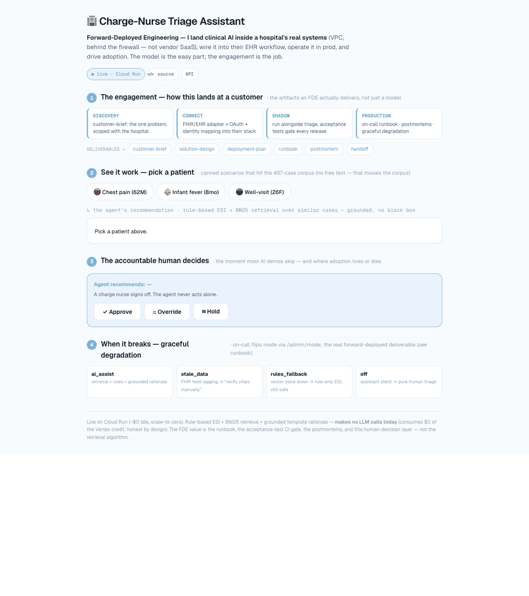

# healthcare-forward-deployed-engineer

> 🩵 **L3 Influence** part of the [L1→L3 healthcare AI platform](https://gozeroshot.dev) — Truth → Features → Signals → Actions → Human adoption. This repo = the forward-deployed layer where a hospital actually adopts the AI (runbook + human Approve/Override).

> **Customer-deployable ER triage assistant** — one hospital problem, one integration path, one workflow, one runbook, one postmortem. Designed for VPC deployment behind a hospital firewall, NOT vendor SaaS. The full "make AI work inside a messy enterprise" loop, not just the model internals.



🔗 **Live:** https://healthcare-fde-2ihyeqmb6q-uw.a.run.app/ · [API docs](https://healthcare-fde-2ihyeqmb6q-uw.a.run.app/docs)

[](https://github.com/anix-lynch/healthcare-forward-deployed-engineer/actions/workflows/acceptance.yml)

**Built for:** AI vendor + health-tech field engineering teams who deploy AI into customer environments. The artifacts here mirror what an FDE actually owns at a hospital site — discovery brief, solution design, runbook, integrations, acceptance tests, smoke deploy, postmortem template.

```
Hospital intake event
  ↓ integrations/ehr_adapter.py            (Epic-like FHIR mock; live swap path documented)
  ↓ integrations/fhir_transform.py         (FHIR Patient/Encounter/Observation → canonical)
  ↓ integrations/identity_mapper.py        (MRN ↔ patient_id, SHA256 short hash)
  ↓ guardrails/{input,output,pii}          (sanitize · injection · citation · PHI redact)
  ↓ workflows/triage_assistant.py          (rule-based ESI + retrieval + grounded rationale)
  ↓ workflows/fallback_logic.py            (escalate-or-fallback decision)
  ↓ app/routers/ask.py                     (FastAPI surface — POST /v1/ask)
  ↓ observability/logging.py               (structured audit row → outputs/audit.jsonl)
  ↓ JSON to charge-nurse UI
```

---

## Quick demo (no server needed)

```bash
git clone https://github.com/anix-lynch/healthcare-forward-deployed-engineer
cd healthcare-forward-deployed-engineer
make install
make demo
```

Output (live, just run it):

```json
{
  "case_id": "DEMO-001",                          // pre-hashed, non-PHI identifier
  "esi_tier": 2,
  "tier_bucket": "NOW",
  "confidence": 0.85,
  "red_flags": [
    "high_risk_keyword:chest pain",
    "high_risk_keyword:diaphoresis",
    "tachycardia"
  ],
  "rationale": "Based on similar past records, the most relevant precedent is L1-000085: \"62yo Male, Hypertension, Emergency admission, treated with Aspirin, test results Abnormal\". Additional supporting precedents: L1-000121, L1-000149. ...",
  "citations": ["L1-000085", "L1-000121", "L1-000149"],
  "similar_cases": [
    {"source_id": "L1-000085", "snippet": "62yo Male, Hypertension, Emergency admission..."}
  ],
  "human_review_required": false,
  "mode": "ai_assist",
  "latency_ms": 6,
  "warnings": []
}
```

Or with Docker:

```bash
make docker-up
sleep 5
make smoke              # post-deploy curl checks (5 smoke tests)
```

---

## Repo Map

```
healthcare-forward-deployed-engineer/
├── app/                         the live FastAPI service
│   ├── main.py                  ✅ entry — wires routers
│   ├── routers/ask.py           ✅ POST /v1/ask — full pipeline (USE_LANGGRAPH flag)
│   ├── routers/admin.py         ✅ mode toggle + recent audit log
│   └── routers/status.py        ✅ health check
├── workflows/                   the decision engine
│   ├── triage_assistant.py      ✅ core triage — ESI scoring + confidence + fallback
│   ├── langgraph_triage.py      ✅ stateful LangGraph agent (8-node, checkpointed)
│   ├── hitl_gate.py             ✅ HITL pause/approve/reject/TTL-expire (SQLite)
│   ├── reliability.py           ✅ @retry @idempotent @with_timeout decorators
│   └── fallback_logic.py        ✅ escalation + rules-fallback shape
├── retrieval/                   ✅ BM25 retriever over 497-row corpus
├── generation/                  ✅ grounded answer + citation validation
├── guardrails/                  ✅ input/output validators + PII masker
├── integrations/                enterprise connectors
│   ├── auth/oauth_client.py     ✅ OAuth client
│   ├── ehr_adapter.py           ✅ EHR data adapter
│   ├── identity_mapper.py       ✅ MRN → safe case_id hashing
│   └── sync_jobs.py             ✅ background sync jobs
├── observability/               ✅ split-sink audit log + OTEL spans + audit report
├── evaluation/                  the proof layer
│   ├── acceptance_tests.py      ✅ 21 customer-contract tests (CI gate)
│   ├── replay_pipeline.py       ✅ dataset replay regression gate (exit 1 if <85%)
│   └── eval_dataset.json        ✅ eval cases
├── docs/                        📖 5 customer-facing FDE deliverables
│   ├── customer-brief.md        📖 problem · constraints · success metrics
│   ├── solution-design.md       📖 end-to-end flow + component map
│   ├── runbook.md               📖 P0–P3 alert ladder + curl commands
│   ├── deployment-plan.md       📖 rollout phases + rollback
│   └── handoff-guide.md         📖 what the customer needs to operate it
├── postmortems/                 🖼️ 2 real-shaped postmortems (ops discipline proof)
├── data/raw/                    ✅ 497-row synthetic healthcare corpus
├── deploy/cloudrun.sh           ✅ ships to Cloud Run
├── deployment/                  ✅ Dockerfile · docker-compose · smoke test
├── TITAN_HANDOVER.md            📖 gap analysis vs Titan FDE JD + before/after
├── .github/workflows/           ✅ CI — acceptance gate + pip-audit on every PR
├── Makefile                     ✅ install · serve · test · acceptance
└── README.md · demo.gif         🖼️📖 the 10-second story
```

---

## What's inside (FDE deliverables)

```
docs/                         5 customer-facing deliverables
   customer-brief.md           business problem · constraints · success metrics
   solution-design.md          end-to-end flow + component status table
   deployment-plan.md          12-phase rollout (discovery → shadow → soft → pilot → full → handoff)
   runbook.md                  P0/P1/P2/P3 alert ladder · escalation contacts · safety floors
   handoff-guide.md            customer-team ownership matrix + first-90-day plan

demo/
   loom-script.md              5-minute walkthrough script
   sample-client-scenarios.md  5 clinical scenarios + expected AI response

integrations/                 customer-system adapters (honest mocks)
   ehr_adapter.py              Epic-like FHIR endpoint stand-in
   fhir_transform.py           FHIR Patient/Encounter/Observation → canonical
   identity_mapper.py           MRN ↔ patient_id (SHA256 short hash)
   auth/oauth_client.py         OAuth client-credentials flow stub
   auth/service_account.py      workload identity stub
   sync_jobs.py                 scheduled identity-map refresh + index warm-up

app/                          FastAPI surface (deployable service)
   main.py                      mount routers
   routers/ask.py               POST /v1/ask — the one workflow
   routers/status.py            GET /health · GET /status
   routers/admin.py             POST /admin/mode — ai_assist | rules_fallback | stale_data | off

workflows/                    the one job this deployment runs
   triage_assistant.py          rule-based ESI + retrieval + grounded rationale
                                 + pediatric/suicidal/chest-pain safety floors
   fallback_logic.py            should_escalate() + to_rules_fallback()

guardrails/                   recycled from healthcare-genai-engineer
   input_validator · output_validator · pii_masker

retrieval/                    BM25 only (no dense — minimize customer-VPC deps)
generation/                   template grounded answer + citation validation
data/raw/                     497-row enriched corpus (shared with sibling repos)

evaluation/                   customer success criteria (NOT ML metrics)
   acceptance_tests.py          10 contract tests
   eval_dataset.json            10 criteria with category + owner

observability/                structured audit logging
   logging.py                   writes outputs/audit.jsonl + stdout JSON line

deployment/                   shippable unit
   Dockerfile                   python:3.11-slim + HEALTHCHECK on /health
   docker-compose.yml           single service · :8000 · audit log volume mount
   smoke_test.sh                5 curl checks after deploy
   env/dev.env + prod.env.example

postmortems/                  2 postmortems (same template)
   002-confidence-detector-blind-spot.md  brief↔code drift bug caught by self-audit → ACC-009 fix
   integration_failure_example.md         real-shaped P1 example w/ timeline + corrective actions

tests/                        pytest — FastAPI TestClient smoke (11 tests)
Makefile · requirements.txt
```

---

## Customer acceptance tests (committed at `evaluation/acceptance_tests.py`)

These are NOT ML metrics. They're the customer-defined success criteria the
contract specifies. If any fail, the deployment isn't done.

```
ACC-001  pediatric < 1y never down-triaged        SAFETY · zero-tolerance per runbook
ACC-002  chest pain + diaphoresis not down-triaged SAFETY · high-risk pattern
ACC-003  well-visit not up-triaged                 EFFICIENCY · don't burn ER resources
ACC-004  suicidal ideation always escalates        SAFETY · owner: safety officer
ACC-005  altered mental status min ESI 2           SAFETY · owner: CMO
ACC-006  sepsis SIRS-shape min ESI 2               SAFETY · qSOFA-shaped
PERF-001 p95 latency < 800ms                       PERFORMANCE · request-boundary
PERF-002 p99 latency < 2000ms                      PERFORMANCE · owner: customer IT
ACC-009  weak evidence → human review              EVIDENCE · fail-by-design (postmortem #002)
SHAPE    response shape complete                   CONTRACT · all required fields
```

The CI workflow (`.github/workflows/acceptance.yml`) runs these on every PR.
A failure blocks merge.

---

## How to think about this repo (FDE lens)

```
ASK                                  ANSWER (where to look)
─────────────────────────────────────────────────────────────────────
"Who's the customer?"                docs/customer-brief.md
"What problem are they solving?"     docs/customer-brief.md (Phase 1 discovery)
"How does data get IN from Epic?"    integrations/ehr_adapter.py + fhir_transform.py
"How does auth work?"                integrations/auth/oauth_client.py + service_account.py
"What does the AI actually do?"      workflows/triage_assistant.py (one workflow, scoped)
"What if AI is wrong?"               workflows/fallback_logic.py + docs/runbook.md
"How do you deploy it?"              deployment/Dockerfile + docker-compose.yml + smoke_test.sh
"How do you debug at 3am?"           docs/runbook.md alert ladder + observability/logging.py
"How does the customer take over?"   docs/handoff-guide.md (ownership matrix + 90-day plan)
"What if it breaks in production?"   postmortems/integration_failure_example.md
"What did your last go-live do?"     docs/deployment-plan.md (phases + rollback per phase)
```

---

## Common commands

```bash
make install      # pip install requirements
make serve        # uvicorn app/main on :8000
make demo         # one /v1/ask via TestClient + print JSON
make test         # pytest tests/
make acceptance   # pytest evaluation/acceptance_tests.py (customer criteria)
make docker-up    # docker-compose up -d (build + run on :8000)
make docker-down  # docker-compose down
make smoke        # bash deployment/smoke_test.sh (5 curl checks)
```

---

## Honest scope

```
WHAT THIS REPO IS                      WHAT IT'S NOT
─────────────────────────────────────────────────────────────────────
✅ one customer-deployment package      ❌ multi-customer SaaS
✅ Epic-like FHIR adapter (mocked)      ❌ real Epic API integration
✅ OAuth + workload identity stubs      ❌ live auth against customer IdP
✅ ER triage workflow with safety       ❌ FDA-cleared clinical decision tool
✅ structured audit log (JSONL)         ❌ HIPAA-compliant 7-year retention infra
✅ runbook + postmortem example         ❌ on-call rotation actually staffed
✅ acceptance tests as contract         ❌ customer signed off (this is a demo customer)
✅ Dockerfile + smoke test               ❌ production K8s deployment
```

The repo is **the FDE deliverable shape**, not a live production deployment.
What it proves: this person knows what an FDE engagement actually requires —
integrations, runbook, deployment phases, handoff, postmortem — not just
"build the model and throw it over the wall."

---

## Record your own demo (asciinema)

```bash
brew install asciinema     # one-time
asciinema rec demo.cast
# inside the recording:
make demo
# Ctrl-D to stop
asciinema upload demo.cast    # free public link
```

Plain-text `.cast` embeds cleanly in any markdown reader.

---

## Roadmap

See [ROADMAP.md](ROADMAP.md) for the phase-ordered audit trail (Phase 1 → 8,
each with the commit hash that shipped it).

---

## Related repos

- [healthcare-genai-engineer](https://github.com/anix-lynch/healthcare-genai-engineer) — Layer 2 GenAI runtime (RAG + evals + guardrails + FastAPI)
- [healthcare-ai-data-engineer](https://github.com/anix-lynch/healthcare-ai-data-engineer) — Layer 1 data backbone (dbt medallion + FastAPI + enrichment + quality gate)
- [healthcare-genai-fullstack](https://github.com/anix-lynch/healthcare-genai-fullstack) — full 3-layer monorepo

---

## License

MIT.